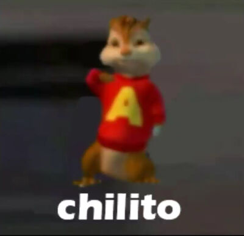

## Welcome to my first repository Al Isa le encanta la riata 

In this repository we are going to see works and exercises of c++
> U1 Programming introduction

> U2 Control structures and cycles

> U3 Functions 

> U4 Files and arrays
