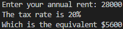
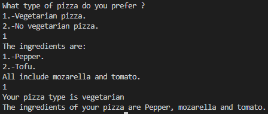
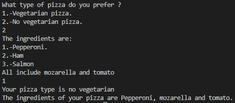

# Index
<h3>

- [Exercise 1](#exercise-1-program-that-asks-the-user-their-annual-income-and-shows-on-the-screen-the-tax-rate-that-corresponds-to-him)  
- [Exercise 2](#exercise-2-a-program-that-asks-the-user-for-his-score-and-displays-the-corresponding-typo-of-benefit-and-money)  
- [Exercise 3](#exercise-3-a-program-that-asks-for-your-age-and-print-the-cost-of-ticked)  
- [Exercise 4](#exercise-4-menu-of-a-bella-napoli-pizzeria-showing-your-type-of-pizza-and-ingredients)  
- [Exercise 5](#exercise-5-ask-the-user-6-temperature-and-print-the-mean-highest-and-lowest-temperature)  
- [Exercise 6](#exercise-6-ask-the-user-indefinitely-the-amount-and-price-of-the-products-finally-print-the-total-price)  
- [Exercise 7](#exercise-7-decimal-to-binary)    
- [Exercise 8](#exercise-8-multiplication-tables)    

<h3>

# Exercise 1: Program that asks the user their annual income and shows on the screen the tax rate that corresponds to him.

## Input
```c++
    cout << "Enter your annual rent: ";
    cin >> Rent;
```
## Process
```c++
    if (Rent>=0){
        if (Rent<10000){
            Tax = .05;
        }
        if (Rent>=10000 and Rent<20000){
            Tax = .15;
        } 
        if (Rent>=20000 and Rent<35000){
            Tax = .20;
        }
     Output   cout << "The tax rate is" << (Tax*100) << "% \n";
        Tax= Rent * Tax;
        cout << "Which is the equivalent $" << Tax << endl;
    }
    else {
        cout << "The rent you entered is ncorrect. \n";  
    }
```
## Output
```c++
    cout << "The tax rate is" << (Tax*100) << "% \n";
    Tax= Rent * Tax;
    cout << "Which is the equivalent $" << Tax << endl;
```
## Explanation
1. Ask the user for his annual rent.
2. Check that the user entered a valid rent.   
3. Check by several if's which tax rate.  
4. Multiply the rent by the tax rate.
5. Print the tax rate and its equivalent in dollars. 
## Tests
### A) Rent < $10,000


### B) Rent >= $10,000 and Rent < $20,000


### C) Rent >= $20,000 and Rent < $35,000 


### D) Rent >= $60,000


<div align="center">
<h2>

[Return to Index](#index)
</h2>
</div>


# Exercise 2: Program that reads the user's score and indicates their performance level, as well as the amount of money the user receives.
## Input
```c++
    cout << "What is your score: ";
    cin >> puntuacion;
```
## Process
```c++
    if( (puntuacion <= 1 ) && ((puntuacion >= 0.6) || (puntuacion == 0.4 ))){
        dinero = puntuacion* 2400;
        if (puntuacion >= 0.6) {
            cout << "Your score is Meritorious \n";
        }else{
            cout << "Your score is Acceptable \n";
        }

    } else{
        cout << "Your score is unacceptable \n";
    }
```
## Output
```c++
    cout << "Your amount of money is $" << dinero << endl;
```
## Explanation
1. Ask the user for his score.
2. Check that the user entered a score greater than or equal to 0.6 or equal to 0.
3. Multiply your score by 2400 and store the cash value.
4. Check what kind of score you obtained  
## Tests
### A) Score >= 0.6


### B) Score == 0.4


### C) Score == 0


<div align="center">
<h2>

[Return to Index](#index)
</h2>
</div>


# Exercise 3: Program for a company that has arcades for all ages and wants to automatically calculate the price it must charge its customers to enter.
## Input
```c++
    cout << "How old are you?  ";
    cin >> edad;
```
## Process
```c++
    if (edad > 18)
    {
        precio = 10;
    }
    else if (edad >= 4 && edad < 18)
    {
        precio = 5;
    }
    else if (edad >= 0)
    {
        precio = 0;
    }
    else
    {
        cout << "Your age is invalid \n";
        precio = 0;
    }

    cout << "The cost of your ticked is $" << precio << endl;
```
## Output
```c++
    cout << "The cost of your ticked is $" << precio << endl;
```
## Explanation
1. Ask the user for your age.
2. Check that the user enters an age within the following range.  
3. Print ticket cost.   
## Tests
### A) Age > 18


### B) Age >= 4 and Age <=18


### C) Age < 4 and Age > 0


### D) Age < 0


<div align="center">
<h2>

[Return to Index](#index)
</h2>
</div>


# Exercise 4: Program that asks the user if he wants a vegetarian pizza or not, and based on his answer shows him a menu with the ingredients available for him to choose.
## Input
```c++
    cout << "Welcome to Bella Napoli. \n";
    cout << "What type of pizza do you prefer ? \n";
    cout << "1.-Vegetarian pizza. \n";
    cout << "2.-No vegetarian pizza. \n";
    cin >> tipo;
```
## Process
### (Select your pizza type and ingredients)
```c++
    if (tipo == 1)
    {
        tipo_1 = "vegetarian";
        cout << "The ingredients are: \n";
        cout << "1.-Pepper. \n";
        cout << "2.-Tofu. \n";
        cout << "All include mozarella and tomato.";
        cin >> ingrediente_vegetariano;

        if (ingrediente_vegetariano == 1)
        {
            ingre = "Pepper";
        }
        else if (ingrediente_vegetariano == 2)
        {
            ingre = "Tofu";
        }
        else
        {
            cout << "Your ingredient does not exit";
        }
    }
    else if (tipo == 2)
    {
        tipo_1 = "no vegetarian";
        cout << "The ingredients are: \n";
        cout << "1.-Pepperoni. \n";
        cout << "2.-Ham \n";
        cout << "3.-Salmon \n";
        cout << "All include mozarella and tomato \n";
        cin >> ingrediente_no_vegetariano;

        if (ingrediente_no_vegetariano == 1)
        {
            ingre = "Pepperoni";
        }
        else if (ingrediente_no_vegetariano == 2)
        {
            ingre = "Ham";
        }
        else if (ingrediente_no_vegetariano == 3)
        {
            ingre = "Salmon";
        }
    }
    else
    {
        cout << "That type of pizza doesn't exit \n";
    } 

    if (tipo==1 || tipo==2){   
        cout << "Your type of pizza is " << tipo_1 << endl;
        cout << "Your ingredients of pizza are " << ingre << ", mozarella and tomato. \n";
    }
```
## Output
```c++
    if (tipo==1 || tipo==2){   
        cout << "Your type of pizza is " << tipo_1 << endl;
        cout << "Your ingredients of pizza are " << ingre << ", mozarella and tomato. \n";
    }
```
## Explanation
1. Ask the user what type of pizza he/she prefers:  
2. Display the menu depending on your type of pizza.
3. Ask what ingredients you want on your pizza.
4. Save the ingredients in a string.
5. Show your type of pizza (vegetarian or non-vegetarian) and the ingredients.
## Tests
### A) Vegetarian Pizza with Pepper as ingredient


### B) Vegetarian Pizza with Tofu as ingredient


### C) Vegetarian Pizza with Pepperoni as ingredient


### D) Non Vegetarian Pizza with Ham as ingredient


### E) Non Vegetarian Pizza with Salmon as ingredient


<div align="center">
<h2>

[Return to Index](#index)
</h2>
</div>


# Exercise 5: Program in which 6 temperatures are entered and determines the average, the lowest and the highest.
## Input
```c++
    cout << "Insert the temperature: ";
    cin >> temperatura;
```
 ## Process
 ```c++
     do
    {
        cout << "Insert the temperature: ";
        cin >> temperatura;
        if (temperatura >= max)
        {
            max = temperatura;
        }
        if (temperatura <= min)
        {
            min = temperatura;
        }
        sumadetemperatura += temperatura;
        contador++;
    } while (contador <= 6);
```
 ## Output
```c++
cout << "The average is " << promedio << " C° \nThe lowest temperature is " << min << " C° \nThe highest temperature is " << max << " C° \n";
```
## Explanation
1. Ask the user 6 temperature.
2. If temparures is higher than the previous one, it save it.
3. If temparures is lower than the previous one, it save it.
4. Print the mean, highest and lower temperature.
## Test


<div align="center">
<h2>

[Return to Index](#index)
</h2>
</div>


# Exercise 6: Program that indefinitely reads quantities of products and their price, and at the end indicates the total of the invoice.
## Input
```c++
    int numproducto = 1;
    float price, amount, total = 0;
    cout << "Please input the amount and price of your products. To end type 0\n\n";
```
 ## Process
```c++
    do
    {
        cout << "Product " << numproducto << "\nAmount: ";
        cin >> amount;
        if (amount <= 0)
        {
            cout << "\nInvalid amount, exiting program\n";
            numproducto++;
            break;
        }
        cout << "Price: ";
        cin >> price;
        if (price < 0)
        {
            cout << "\nInvalid amount, exiting program\n";
            numproducto++;
            break;
        }
        numproducto++;
        total += (price * amount);
    } while (price != 0);
```
 ## Output
```c++
    cout << "\nYou've inputted a total of " << numproducto - 2 << " different products. ";
    cout << "\nYour total is: " << total << "$ \n\n";
```
## Explanation
1. Ask the user the amount. 
2. Ask the user the price.
3. If the user enter 0 in amount, exit the cycle.
4. Print the total price of all products.
## Test


<div align="center">
<h2>

[Return to Index](#index)
</h2>
</div>


# Exercise 7: Program that changes a decimal number to binary, only for integers greater than 0.
## Input
```c++
    do
    {
        cout << "Input a decimal number \n";
        cin >> num;
```
## Process
```c++
        if (num > 0)
        {
            while (num > 0)
            {
                if (num % 2 == 0)
                {
                    binary = '0' + binary;
                }
                else
                {
                    binary = '1' + binary;
                }
                num /= 2;
            }
```
## Output
```c++
            cout << "The number you've inputted is " << binary;
            cout << endl;
        }
        else if (num == 0)
        {
            cout << "You've inputted a 0\n";
        }
        else
        {
            cout << "The number must be greater than 0\n";
        }
    } while (num < 0);
```
## Explanation
1. Ask the user to input a value
2. In case the user writes a 0, exit the program
3. In case the user writes a negative number, loop the program
4. If the number written is valid, keep dividing the number by two and keep writing the residue of the division until the number is equal to 0.
5. Print out the string of values done by the formula.
6. Return 0 to check that the program ran correctly
## Tests
### A) Number >= 0


### B) Number < 0


<div align="center">
<h2>

[Return to Index](#index)
</h2>
</div>


# Exercise 8: 