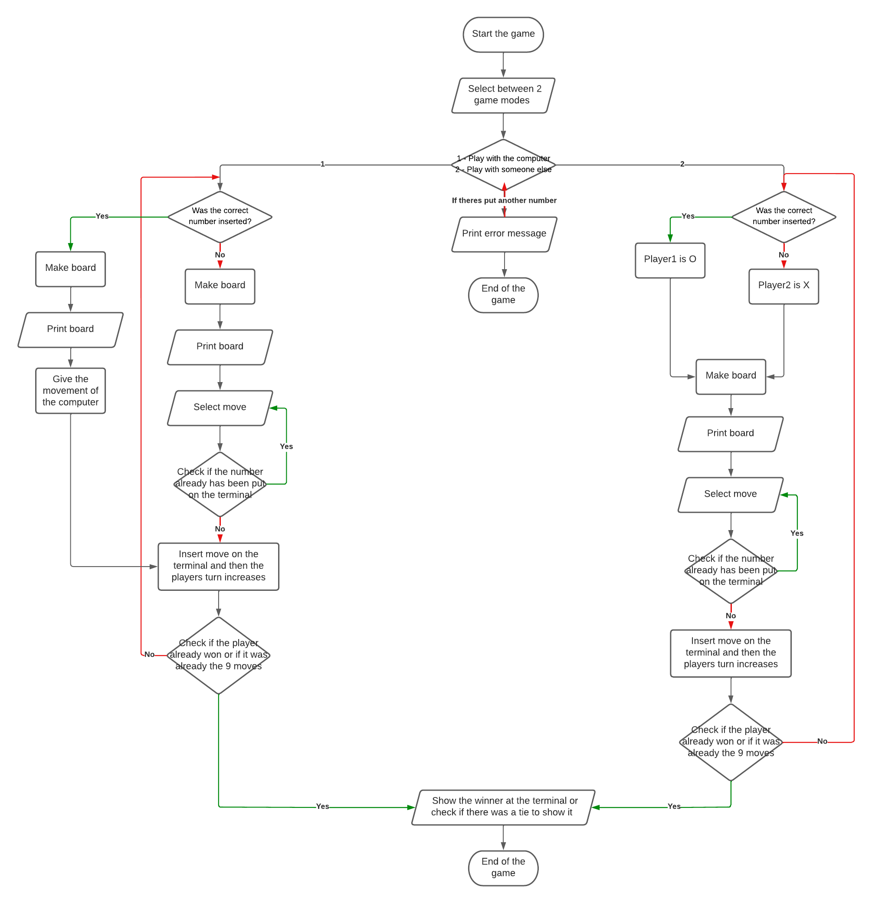

# Tic tac toe Game

# Index

<h3>

- [Tic tac toe Game](#tic-tac-toe-game)
- [Index](#index)
- [Instructions for execution and use](#instructions-for-execution-and-use)
  - [Instructions for Windows](#instructions-for-windows)
  - [Instructions for Linux](#instructions-for-linux)
- [Flowchart](#flowchart)
- [Test](#test)
- [Conclusion](#conclusion)

<h3>

# Instructions for execution and use
## Instructions for Windows 

1. Download or clone my repo with the following command in the terminal:
   
~~~
"git clone https://github.com/UP210644/UP210644_CPP.git"
~~~

2. Download and install the compiler in this link https://sourceforge.net/projects/mingw/files/OldFiles/ 
3. Open the terminal at the direction of the file with the command:

~~~
cd C:\Documents\...
~~~

4. To compile use command:

~~~
gcc  04_Gato.cpp -o 04_Gato.exe
~~~

5. To run type this code:

~~~
04_Gato.exe
~~~

## Instructions for Linux 

1. Download or clone my repo with the following command in the terminal:
   
~~~
"git clone https://github.com/UP210644/UP210644_CPP.git"
~~~

2. Install GNU c/c++ compiler, open the terminal and type:

~~~
$ sudo apt-get update
$ sudo apt-get install build-essential manpages-dev
~~~

3. To compile this program, type:

~~~
gcc 04_Gato.c -o 04_Gato
~~~

4. To run this program, type:
   
~~~
./04_Gato
~~~

<h2>

[Return to Index](#index)
</h2>

# Flowchart

<h2>

[Return to Index](#index)
</h2>

# Test

- Player1 is X
- Player2 is O
- (This is an example of player versus player)

The first thing will be the terminal showing which game mode you want to play

Game mode 1 is selected to play against the computer, in the table you can use the numbers from 1 to 9

My first move is cell 9, the computer as you can see is cell 2

  

My next move is cell 1, the one on the computer as you can see is cell 2

  

My next move is cell 7, the one on the computer as you can see is cell 8. As you can see in the terminal says the computer won.

  

<h2>

[Return to Index](#index)
</h2>

# Conclusion

This work helped me to know and reinforce my knowledge of programming, it was entertaining to program this work but it was also very difficult for the part of artificial intelligence. I had to investigate on the internet how to improve my program so that it was the best possible.The artificial intelligence was the most cost me since it gave me error after error but in the end I was able to get what I wanted.

<h2>

[Return to Index](#index)
</h2>

